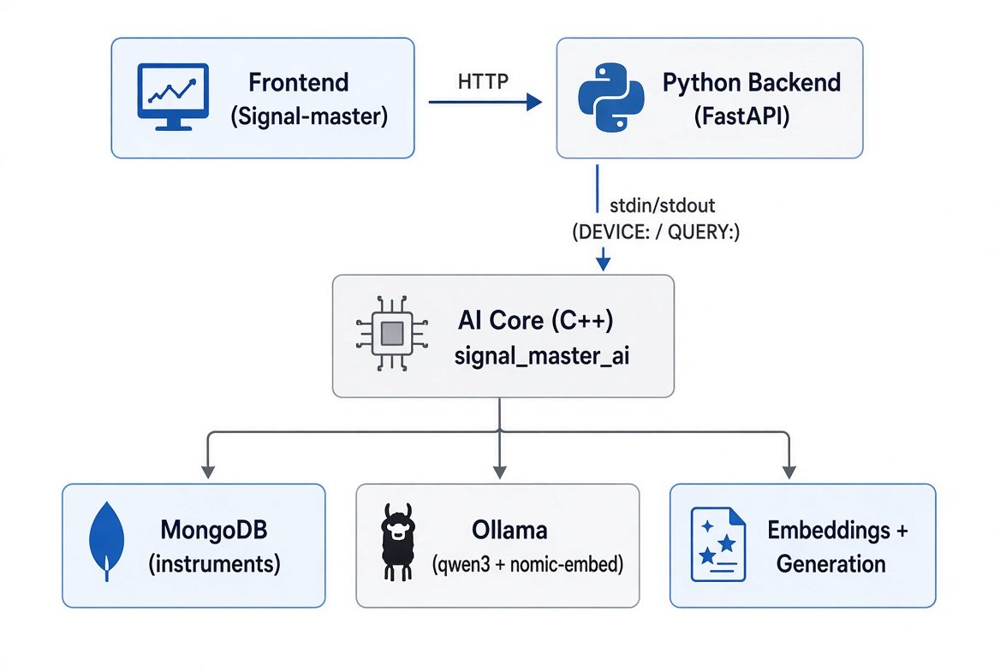

# Signal Master AI Assistant

**Локальный интеллектуальный AI-ассистент** для поддержки пользователей при работе с измерительным лабораторным оборудованием (осциллографы, генераторы сигналов и др.) в рамках информационной системы **Signal-master**.

Проект выполнен как курсовой проект по направлению 09.03.02 «Информационные системы и технологии»  
(Кубанский государственный университет, 2026).

**Репозиторий:** [https://github.com/VortexCodeRU/signal-master-ai](https://github.com/VortexCodeRU/signal-master-ai)

---

## О проекте

Система представляет собой **локальный RAG-ассистент** (Retrieval-Augmented Generation), который:

- автоматически распознаёт подключённый прибор по SCPI-команде `*IDN?`;
- извлекает релевантные разделы руководства пользователя из MongoDB с помощью семантического поиска (эмбеддинги + cosine similarity);
- генерирует понятные ответы на естественном языке с помощью локальных LLM через Ollama;
- работает **полностью автономно** (без интернета и облачных сервисов);
- выступает **строго в роли ментора** — только объясняет, не выполняет команды на приборе.

Целевая платформа: **Raspberry Pi 5** (Debian 13, ARM64).  
Разработка велась на Windows (Visual Studio 2022), затем выполнен перенос на Linux.

---

## Основные возможности

- Автоматическое определение модели прибора по `*IDN?`
- Семантический поиск по руководству пользователя (RAG)
- Два режима генерации ответов:
  - **Быстрый** — `qwen3:1.7b` (≈ 4–8 сек)
  - **Глубокий** — `qwen3:4b` (≈ 40–65 сек, с механизмом «thinking»)
- Полная автономность (локальные модели Ollama)
- Поддержка русского языка
- Жёсткие ограничения роли: ассистент никогда не управляет прибором
- Межпроцессное взаимодействие с Python Backend (FastAPI) через stdin/stdout

---

## Архитектура



### Компоненты

| Компонент | Технология | Назначение |
|-----------|------------|------------|
| **AI Core** | C++17 | Семантический поиск, RAG, работа с MongoDB и Ollama |
| **Backend** | FastAPI (Python) | HTTP API, взаимодействие с фронтендом и AI-ядром |
| **База знаний** | MongoDB | Хранение руководств, эмбеддингов и SCPI-команд |
| **LLM / Embeddings** | Ollama | `qwen3:1.7b`, `qwen3:4b`, `nomic-embed-text` |

---

## Технологический стек

- **Язык ядра:** C++17
- **Сборка:** CMake + vcpkg (`arm64-linux`) / Visual Studio 2022
- **Библиотеки:**
  - mongo-cxx-driver
  - nlohmann-json
  - cpp-httplib
- **База данных:** MongoDB
- **Локальные модели:** Ollama
- **Backend:** FastAPI
- **Целевая ОС:** Debian 13 (ARM64) / Raspberry Pi 5

---

## Требования

Для работы AI-ядра необходимы следующие компоненты:

### MongoDB
- Адрес: `mongodb://localhost:27017`
- База данных: `instruments`
- Коллекция: `devices`

### Ollama
- Адрес сервера: `http://127.0.0.1:11434`

### Модели Ollama

| Модель | Назначение | Константа в коде |
|--------|------------|------------------|
| `qwen3:1.7b` | Быстрый режим генерации ответов | `FAST_MODEL` |
| `qwen3:4b` | Глубокий режим (по умолчанию) | `DEEP_MODEL` |
| `nomic-embed-text` | Эмбеддинги для семантического поиска (RAG) | `EMBED_MODEL` |

Установка моделей:

```bash
ollama pull qwen3:1.7b
ollama pull qwen3:4b
ollama pull nomic-embed-text
```
Проверка: ollama list

